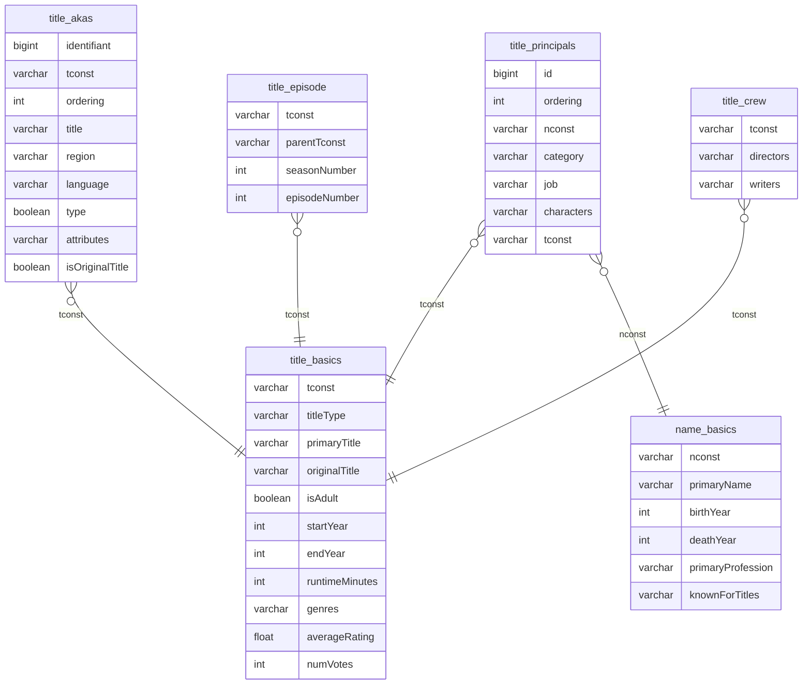

# Netfloox_g0_JohnBondouxDuplaix

Vous êtes en charge de :
- Développer une base de données SQL pour le stockage et l'exploitation des données.
- Développer un système de recommandation de contenu vidéo. Usage final : proposer aux clients des contenus susceptibles des les intéresser.
- Développer un système de prédiction de popularité d'un contenu vidéo. Usage final : aider les équipes de production de contenu vidéo pour définir les caractéristiques susceptibles d'influencer la popularité (satisfaction) du contenu.
- Développer une application utilisateur (interface web) pour l'utilisation des services d'IA.

Outils :
- Git
- PostgreSQL
- Machine learning
- Veille

Contexte du projet

En tant que développeur en intelligence artificielle,

Pour la base de données :

- Rédaction des spécifications techniques pour le stockage des données.
- Modélisation de la structure des données de la base de données selon la méthode Merise*.
- Choix du système de gestion de base de données.
- Création de la base de données dans le système de gestion de base de données.
- Documentation de la procédure d’installation du système de gestion de base de données.
- Programmation du script d’import des données en base de données.
- Documentation du script d’import.
- Modélisation des données de l’application (par exemple, entités-relations, MCD/MPD, etc).

​

Pour les services d'IA :

- Choix des algorithmes de recommandations et de régression
- Création des pipelines nécessaires intégrant le preprocessing
- Evaluation des performances des services d'IA développés

​

Pour l'application :

- Rédaction des spécifications fonctionnelles sous forme de user story.
- Développement et intégration des des fonctionnalités

Livrables :

- Un modèle relationnel de données
- Une base de données alimentées
- Un algorithme de recommandation
- Un algorithme de prédiction de la popularité
- Une interface web permettant à l'utilisateur de :
- Observer les analyses graphiques et statistiques de la base de données
- Renseigner un film qu'il a apprécié et d'obtenir une liste de 5 films susceptibles de l'intéresser.
- Renseigner des caractéristiques de film (genre, acteur, producteur, etc) est d'en estimer la popularité potentielle. 

et :
- Une présentation écrite et orale résumant vos travaux.
- Un dépôt Github.
- Un Trello du projet

Critères de performance : 
L'application web est fonctionnelle et elle répond aux attentes du projet.

## User Storys
- En tant qu’utilisateur qui souhaite regarder un film, je souhaite rentrer un film que j’ai aimé et obtenir une suggestion de 5 films à regarder en rentrant le nom dans un champ de texte dans une application web
- En tant que producteur de film, je souhaite rentrer les caractéristiques d’un film que je souhaite produire et obtenir une estimation de sa popularité, en rentrant les caractéristiques dans des champs dans une application web
- En tant qu’utilisateur, je souhaite observer les caractéristiques des films de la base de données IMDB via des graphiques sur une application web

## MCD

## features utilisée

- primarytitle
- titletype
- isadult
- startyear
- genres
- agrégation / pondération de la colonne averagerating et numvotes
- runtimeminutes
- seasonnumber
- episodenumber
- nombre de régions dispo
- liste des régions dispo
- category (acteur, self, actrice) des primary name

## Performances du modèle de prédiction de popularité
MSE:  0.0003  
MAE:  0.0032  
R2:   0.3061  
 

## Lignes en moins si ajout des clés étrangères

title_principals -> title_basics : 67 215 123 / 90 000 000  
title_principals-> name_basics : 90 0000 000 / 90 000 000   
title_princpals -> title_basics & name_basics : 67 000 000 / 90 000 000   
title_crew -> title_basics : 11 000 000 / 11 000 000   
title_akas -> title_basics : 40 000 000 / 47 000 000  
title_episode -> title_basics : 7 000 000 / 8 000 000
